# Non And Semi Parametric Survival Analysis - DrPH(Epid)
Kamarul Imran Musa  
18 April 2016  


\newpage

# Cox proportional hazard model

## Introduction

### The coxph function

The Cox proportional-hazards regression model can be fit in R with the `survival::coxph` function.

The argumen *method* indicates how to handle observations that have tied (i.e., identical) survival times. The default "efron" method is generally preferred to the once-popular "breslow" method.

# Initial preparation

## Prepare folder and file

Set the working directory to store all the working datasets and also the outputs. 


```r
setwd("E:/Epi_Stat_Matters/LectureNotes2015/Survival-Analysis/survival-analysis-DrPH-epid-2015/Practicals/Survival_Analysis_DrPH/NonAndSemiParametricSurvivalAnalysis")

list.files()
```

```
## [1] "addicts.dta"                               
## [2] "NonAndSemipara.pdf"                        
## [3] "NonAndSemipara.Rmd"                        
## [4] "NonAndSemipara_DrPH_Epid.pdf"              
## [5] "NonAndSemipara_DrPH_Epid.Rmd"              
## [6] "NonAndSemiParametricSurvivalAnalysis.Rproj"
```

## Read data

We can use `foreigh::read.dta` to read stata format data. 


```r
library(foreign)
data1<-read.dta('addicts.dta',convert.factors = T)
```

## Load library 

The popular package to run survival analysis in R is `survival`package. We can load the package using the `library` function


```r
library(survival)
```

# Preliminary analysis

## Declare file as a survival data format

It is important to tell R that the data for survival analysis is in the time-to-event format. We need to specify:

1.  variable time
2.  variable event. What would be the event of interest. The rest will be censored observations. 

When can see the summary of the data


```r
datas <- Surv(time = data1$survt,event = data1$status == 1)
summary(datas)
```

```
##       time            status      
##  Min.   :   2.0   Min.   :0.0000  
##  1st Qu.: 171.2   1st Qu.:0.0000  
##  Median : 367.5   Median :1.0000  
##  Mean   : 402.6   Mean   :0.6303  
##  3rd Qu.: 585.5   3rd Qu.:1.0000  
##  Max.   :1076.0   Max.   :1.0000
```

## Overview of data

Let us see the first 50 observations for the 

1.  time-to-event data
2.  the original data


```r
head(datas,50)
```

```
##  [1] 428  275  262  183  259  714  438  796+ 892  393  161+ 836  523  612 
## [15] 212  399  771  514  512  624  209  341  299  826+ 262  566+ 368  302 
## [29] 602+ 652  293  564+ 394  755  591  787+ 739  550  837  612  581+ 523 
## [43] 504  785  774  560  160  482  518  683
```

```r
head(data1,50)
```

```
##    id  clinic status survt           prison dose
## 1   1 clinic1      1   428        no record   50
## 2   2 clinic1      1   275 has_previous_rec   55
## 3   3 clinic1      1   262        no record   55
## 4   4 clinic1      1   183        no record   30
## 5   5 clinic1      1   259 has_previous_rec   65
## 6   6 clinic1      1   714        no record   55
## 7   7 clinic1      1   438 has_previous_rec   65
## 8   8 clinic1      0   796 has_previous_rec   60
## 9   9 clinic1      1   892        no record   50
## 10 10 clinic1      1   393 has_previous_rec   65
## 11 11 clinic1      0   161 has_previous_rec   80
## 12 12 clinic1      1   836 has_previous_rec   60
## 13 13 clinic1      1   523        no record   55
## 14 14 clinic1      1   612        no record   70
## 15 15 clinic1      1   212 has_previous_rec   60
## 16 16 clinic1      1   399 has_previous_rec   60
## 17 17 clinic1      1   771 has_previous_rec   75
## 18 18 clinic1      1   514 has_previous_rec   80
## 19 19 clinic1      1   512        no record   80
## 20 21 clinic1      1   624 has_previous_rec   80
## 21 22 clinic1      1   209 has_previous_rec   60
## 22 23 clinic1      1   341 has_previous_rec   60
## 23 24 clinic1      1   299        no record   55
## 24 25 clinic1      0   826        no record   80
## 25 26 clinic1      1   262 has_previous_rec   65
## 26 27 clinic1      0   566 has_previous_rec   45
## 27 28 clinic1      1   368 has_previous_rec   55
## 28 30 clinic1      1   302 has_previous_rec   50
## 29 31 clinic1      0   602        no record   60
## 30 32 clinic1      1   652        no record   80
## 31 33 clinic1      1   293        no record   65
## 32 34 clinic1      0   564        no record   60
## 33 36 clinic1      1   394 has_previous_rec   55
## 34 37 clinic1      1   755 has_previous_rec   65
## 35 38 clinic1      1   591        no record   55
## 36 39 clinic1      0   787        no record   80
## 37 40 clinic1      1   739        no record   60
## 38 41 clinic1      1   550 has_previous_rec   60
## 39 42 clinic1      1   837        no record   60
## 40 43 clinic1      1   612        no record   65
## 41 44 clinic1      0   581        no record   70
## 42 45 clinic1      1   523        no record   60
## 43 46 clinic1      1   504 has_previous_rec   60
## 44 48 clinic1      1   785 has_previous_rec   80
## 45 49 clinic1      1   774 has_previous_rec   65
## 46 50 clinic1      1   560        no record   65
## 47 51 clinic1      1   160        no record   35
## 48 52 clinic1      1   482        no record   30
## 49 53 clinic1      1   518        no record   65
## 50 54 clinic1      1   683        no record   50
```

+ sign is for censored observation

# Estimation of the survival based on non-parametric method

To estimate the expected survival probability, we can use the non-parametric method. The most popular one is the Kaplan-Meier survival estimate. 

## Estimate the crude (unadjusted) survival functions for all 

Using the intercept-only model to obtain Kaplan-Meier survival estimates for all event times. 


```r
surv.fit<-survfit(datas~1, data = data1)
summary(surv.fit)
```

```
## Call: survfit(formula = datas ~ 1, data = data1)
## 
##  time n.risk n.event survival std.err lower 95% CI upper 95% CI
##     7    236       1    0.996 0.00423       0.9875        1.000
##    13    235       1    0.992 0.00597       0.9799        1.000
##    17    234       1    0.987 0.00729       0.9731        1.000
##    19    233       1    0.983 0.00840       0.9667        1.000
##    26    232       1    0.979 0.00937       0.9606        0.997
##    29    229       1    0.975 0.01026       0.9546        0.995
##    30    228       1    0.970 0.01107       0.9488        0.992
##    33    227       1    0.966 0.01182       0.9431        0.989
##    35    226       2    0.957 0.01317       0.9320        0.984
##    37    224       1    0.953 0.01379       0.9265        0.981
##    41    223       2    0.945 0.01493       0.9158        0.974
##    47    221       1    0.940 0.01546       0.9105        0.971
##    49    220       1    0.936 0.01597       0.9053        0.968
##    50    219       1    0.932 0.01646       0.9001        0.965
##    59    216       1    0.927 0.01694       0.8949        0.961
##    62    215       1    0.923 0.01740       0.8897        0.958
##    67    213       1    0.919 0.01785       0.8845        0.954
##    75    211       1    0.914 0.01829       0.8793        0.951
##    79    210       1    0.910 0.01871       0.8742        0.948
##    84    209       1    0.906 0.01913       0.8691        0.944
##    90    207       1    0.901 0.01953       0.8639        0.940
##    95    206       1    0.897 0.01992       0.8588        0.937
##    96    205       1    0.893 0.02029       0.8537        0.933
##   109    202       1    0.888 0.02067       0.8486        0.930
##   117    200       1    0.884 0.02104       0.8435        0.926
##   122    199       1    0.879 0.02140       0.8384        0.922
##   126    198       1    0.875 0.02174       0.8333        0.919
##   127    197       1    0.870 0.02208       0.8282        0.915
##   129    196       1    0.866 0.02241       0.8232        0.911
##   136    194       1    0.862 0.02274       0.8181        0.907
##   143    193       1    0.857 0.02305       0.8131        0.903
##   145    192       1    0.853 0.02336       0.8080        0.900
##   147    190       1    0.848 0.02366       0.8030        0.896
##   149    188       1    0.844 0.02396       0.7979        0.892
##   150    187       1    0.839 0.02426       0.7929        0.888
##   157    185       1    0.835 0.02455       0.7878        0.884
##   160    184       1    0.830 0.02483       0.7828        0.880
##   161    183       1    0.826 0.02510       0.7777        0.876
##   167    181       1    0.821 0.02538       0.7727        0.872
##   168    180       1    0.816 0.02564       0.7676        0.868
##   170    179       1    0.812 0.02590       0.7626        0.864
##   175    178       1    0.807 0.02615       0.7576        0.860
##   176    176       1    0.803 0.02640       0.7526        0.856
##   180    175       2    0.794 0.02689       0.7425        0.848
##   181    173       1    0.789 0.02712       0.7375        0.844
##   183    172       1    0.784 0.02735       0.7325        0.840
##   190    171       1    0.780 0.02757       0.7275        0.836
##   192    170       1    0.775 0.02779       0.7226        0.832
##   193    169       1    0.771 0.02800       0.7176        0.827
##   204    168       1    0.766 0.02821       0.7127        0.823
##   205    166       1    0.761 0.02841       0.7077        0.819
##   207    165       1    0.757 0.02861       0.7027        0.815
##   209    164       1    0.752 0.02881       0.6978        0.811
##   212    162       2    0.743 0.02919       0.6878        0.802
##   216    160       2    0.734 0.02955       0.6779        0.794
##   223    157       1    0.729 0.02973       0.6729        0.790
##   231    156       1    0.724 0.02991       0.6679        0.785
##   232    155       1    0.720 0.03008       0.6630        0.781
##   237    154       1    0.715 0.03024       0.6580        0.777
##   244    153       1    0.710 0.03040       0.6531        0.772
##   247    152       1    0.706 0.03056       0.6481        0.768
##   257    151       1    0.701 0.03071       0.6432        0.764
##   258    150       1    0.696 0.03086       0.6383        0.759
##   259    149       1    0.692 0.03101       0.6333        0.755
##   262    148       2    0.682 0.03128       0.6235        0.746
##   268    146       2    0.673 0.03154       0.6138        0.738
##   275    144       1    0.668 0.03167       0.6089        0.733
##   280    143       1    0.663 0.03179       0.6040        0.729
##   286    141       1    0.659 0.03191       0.5991        0.724
##   293    140       1    0.654 0.03203       0.5942        0.720
##   294    139       1    0.649 0.03214       0.5893        0.716
##   299    138       1    0.645 0.03225       0.5844        0.711
##   302    137       1    0.640 0.03236       0.5796        0.707
##   314    136       1    0.635 0.03246       0.5747        0.702
##   322    134       1    0.631 0.03256       0.5698        0.698
##   337    131       1    0.626 0.03267       0.5648        0.693
##   341    129       1    0.621 0.03277       0.5598        0.689
##   348    126       1    0.616 0.03288       0.5547        0.684
##   350    125       1    0.611 0.03298       0.5496        0.679
##   358    124       1    0.606 0.03308       0.5446        0.675
##   366    122       1    0.601 0.03318       0.5395        0.670
##   367    121       1    0.596 0.03328       0.5343        0.665
##   368    119       1    0.591 0.03338       0.5292        0.660
##   376    118       1    0.586 0.03347       0.5241        0.656
##   386    117       1    0.581 0.03355       0.5189        0.651
##   389    116       1    0.576 0.03364       0.5138        0.646
##   393    115       1    0.571 0.03371       0.5087        0.641
##   394    114       1    0.566 0.03379       0.5036        0.636
##   399    112       1    0.561 0.03386       0.4984        0.631
##   428    109       1    0.556 0.03394       0.4932        0.627
##   434    108       1    0.551 0.03401       0.4879        0.622
##   438    107       1    0.546 0.03408       0.4827        0.617
##   450    105       1    0.540 0.03415       0.4774        0.612
##   452    104       1    0.535 0.03422       0.4722        0.607
##   457    102       1    0.530 0.03428       0.4668        0.602
##   460    101       1    0.525 0.03434       0.4615        0.597
##   465     99       1    0.519 0.03440       0.4562        0.591
##   482     96       1    0.514 0.03447       0.4507        0.586
##   489     95       1    0.509 0.03453       0.4452        0.581
##   496     94       1    0.503 0.03458       0.4398        0.576
##   504     92       1    0.498 0.03463       0.4342        0.570
##   512     91       1    0.492 0.03468       0.4287        0.565
##   514     90       1    0.487 0.03473       0.4232        0.560
##   517     89       1    0.481 0.03476       0.4178        0.554
##   518     87       1    0.476 0.03480       0.4122        0.549
##   522     86       1    0.470 0.03483       0.4067        0.544
##   523     85       2    0.459 0.03488       0.3956        0.533
##   532     80       1    0.453 0.03491       0.3899        0.527
##   533     78       1    0.448 0.03495       0.3841        0.522
##   540     77       1    0.442 0.03497       0.3783        0.516
##   546     74       1    0.436 0.03501       0.3723        0.510
##   550     73       1    0.430 0.03503       0.3664        0.504
##   560     70       1    0.424 0.03507       0.3603        0.498
##   563     69       1    0.418 0.03509       0.3542        0.492
##   581     62       1    0.411 0.03517       0.3474        0.486
##   591     59       1    0.404 0.03525       0.3404        0.479
##   612     54       2    0.389 0.03550       0.3252        0.465
##   624     51       1    0.381 0.03561       0.3175        0.458
##   646     48       1    0.373 0.03574       0.3095        0.450
##   652     47       1    0.365 0.03586       0.3015        0.443
##   661     46       1    0.357 0.03595       0.2935        0.435
##   667     45       1    0.350 0.03601       0.2856        0.428
##   679     44       1    0.342 0.03606       0.2777        0.420
##   683     43       1    0.334 0.03609       0.2699        0.412
##   708     39       1    0.325 0.03616       0.2614        0.404
##   714     37       1    0.316 0.03623       0.2527        0.396
##   739     35       1    0.307 0.03631       0.2437        0.387
##   749     34       1    0.298 0.03635       0.2348        0.379
##   755     33       1    0.289 0.03635       0.2260        0.370
##   760     32       1    0.280 0.03632       0.2173        0.361
##   771     28       1    0.270 0.03638       0.2075        0.352
##   774     27       1    0.260 0.03638       0.1978        0.342
##   785     26       1    0.250 0.03633       0.1882        0.332
##   821     20       2    0.225 0.03675       0.1635        0.310
##   836     17       1    0.212 0.03690       0.1506        0.298
##   837     16       1    0.199 0.03689       0.1380        0.286
##   857     14       1    0.184 0.03688       0.1246        0.273
##   878     13       1    0.170 0.03667       0.1116        0.260
##   892     10       1    0.153 0.03675       0.0958        0.245
##   899      9       1    0.136 0.03639       0.0807        0.230
```

And also for a specific time for example the expected survival at time 100.


```r
summary(surv.fit,times = 100)
```

```
## Call: survfit(formula = datas ~ 1, data = data1)
## 
##  time n.risk n.event survival std.err lower 95% CI upper 95% CI
##   100    203      25    0.893  0.0203        0.854        0.933
```

## Estimate crude (unadjusted) survival functions for strata

For each clinic


```r
surv.clin<-survfit(datas~clinic, data = data1)
summary(surv.clin)
```

```
## Call: survfit(formula = datas ~ clinic, data = data1)
## 
##                 clinic=clinic1 
##  time n.risk n.event survival std.err lower 95% CI upper 95% CI
##     7    162       1   0.9938 0.00615      0.98184        1.000
##    17    161       1   0.9877 0.00868      0.97080        1.000
##    19    160       1   0.9815 0.01059      0.96094        1.000
##    29    157       1   0.9752 0.01223      0.95155        0.999
##    30    156       1   0.9690 0.01366      0.94258        0.996
##    33    155       1   0.9627 0.01493      0.93390        0.992
##    35    154       1   0.9565 0.01609      0.92545        0.989
##    37    153       1   0.9502 0.01716      0.91719        0.984
##    41    152       1   0.9440 0.01815      0.90907        0.980
##    47    151       1   0.9377 0.01907      0.90107        0.976
##    49    150       1   0.9315 0.01994      0.89319        0.971
##    50    149       1   0.9252 0.02077      0.88540        0.967
##    59    147       1   0.9189 0.02156      0.87763        0.962
##    62    146       1   0.9126 0.02231      0.86993        0.957
##    67    144       1   0.9063 0.02304      0.86224        0.953
##    75    143       1   0.9000 0.02373      0.85462        0.948
##    84    142       1   0.8936 0.02440      0.84706        0.943
##    90    141       1   0.8873 0.02503      0.83955        0.938
##    95    140       1   0.8809 0.02564      0.83209        0.933
##    96    139       1   0.8746 0.02623      0.82467        0.928
##   117    135       1   0.8681 0.02683      0.81711        0.922
##   126    134       1   0.8616 0.02740      0.80959        0.917
##   127    133       1   0.8552 0.02795      0.80211        0.912
##   129    132       1   0.8487 0.02848      0.79467        0.906
##   136    130       1   0.8422 0.02899      0.78721        0.901
##   145    129       1   0.8356 0.02950      0.77978        0.895
##   147    128       1   0.8291 0.02998      0.77238        0.890
##   150    126       1   0.8225 0.03045      0.76495        0.884
##   157    124       1   0.8159 0.03092      0.75748        0.879
##   160    123       1   0.8093 0.03138      0.75004        0.873
##   167    121       1   0.8026 0.03182      0.74256        0.867
##   168    120       1   0.7959 0.03225      0.73512        0.862
##   175    119       1   0.7892 0.03267      0.72770        0.856
##   176    117       1   0.7824 0.03308      0.72023        0.850
##   180    116       2   0.7690 0.03385      0.70539        0.838
##   181    114       1   0.7622 0.03422      0.69801        0.832
##   183    113       1   0.7555 0.03458      0.69065        0.826
##   192    112       1   0.7487 0.03492      0.68331        0.820
##   193    111       1   0.7420 0.03525      0.67601        0.814
##   204    110       1   0.7352 0.03557      0.66872        0.808
##   205    108       1   0.7284 0.03589      0.66138        0.802
##   207    107       1   0.7216 0.03619      0.65406        0.796
##   209    106       1   0.7148 0.03648      0.64676        0.790
##   212    104       2   0.7011 0.03705      0.63207        0.778
##   216    102       1   0.6942 0.03732      0.62476        0.771
##   223    101       1   0.6873 0.03758      0.61747        0.765
##   237    100       1   0.6804 0.03783      0.61020        0.759
##   244     99       1   0.6736 0.03807      0.60295        0.752
##   247     98       1   0.6667 0.03829      0.59571        0.746
##   257     97       1   0.6598 0.03851      0.58850        0.740
##   258     96       1   0.6530 0.03872      0.58131        0.733
##   259     95       1   0.6461 0.03892      0.57413        0.727
##   262     94       2   0.6323 0.03928      0.55984        0.714
##   275     92       1   0.6255 0.03945      0.55272        0.708
##   293     90       1   0.6185 0.03962      0.54553        0.701
##   294     89       1   0.6116 0.03978      0.53836        0.695
##   299     88       1   0.6046 0.03993      0.53120        0.688
##   302     87       1   0.5977 0.04007      0.52406        0.682
##   314     86       1   0.5907 0.04020      0.51694        0.675
##   337     83       1   0.5836 0.04035      0.50964        0.668
##   341     81       1   0.5764 0.04049      0.50226        0.661
##   348     78       1   0.5690 0.04063      0.49468        0.654
##   350     77       1   0.5616 0.04077      0.48712        0.647
##   358     76       1   0.5542 0.04090      0.47958        0.640
##   367     75       1   0.5468 0.04102      0.47207        0.633
##   368     74       1   0.5394 0.04112      0.46457        0.626
##   376     73       1   0.5321 0.04122      0.45710        0.619
##   386     72       1   0.5247 0.04130      0.44964        0.612
##   393     71       1   0.5173 0.04138      0.44221        0.605
##   394     70       1   0.5099 0.04144      0.43480        0.598
##   399     69       1   0.5025 0.04149      0.42741        0.591
##   428     66       1   0.4949 0.04156      0.41978        0.583
##   434     65       1   0.4873 0.04161      0.41217        0.576
##   438     64       1   0.4797 0.04165      0.40459        0.569
##   452     62       1   0.4719 0.04169      0.39688        0.561
##   457     61       1   0.4642 0.04172      0.38921        0.554
##   465     59       1   0.4563 0.04175      0.38140        0.546
##   482     56       1   0.4482 0.04179      0.37331        0.538
##   489     55       1   0.4400 0.04182      0.36524        0.530
##   496     54       1   0.4319 0.04183      0.35719        0.522
##   504     53       1   0.4237 0.04183      0.34918        0.514
##   512     52       1   0.4156 0.04181      0.34120        0.506
##   514     51       1   0.4074 0.04177      0.33325        0.498
##   517     50       1   0.3993 0.04173      0.32532        0.490
##   518     48       1   0.3910 0.04168      0.31724        0.482
##   522     47       1   0.3826 0.04161      0.30918        0.474
##   523     46       2   0.3660 0.04143      0.29317        0.457
##   532     44       1   0.3577 0.04132      0.28521        0.449
##   533     43       1   0.3494 0.04119      0.27729        0.440
##   546     40       1   0.3406 0.04107      0.26894        0.431
##   550     39       1   0.3319 0.04094      0.26062        0.423
##   560     38       1   0.3232 0.04078      0.25235        0.414
##   563     37       1   0.3144 0.04060      0.24412        0.405
##   581     33       1   0.3049 0.04048      0.23505        0.396
##   591     31       1   0.2951 0.04035      0.22570        0.386
##   612     29       2   0.2747 0.04005      0.20644        0.366
##   624     26       1   0.2641 0.03988      0.19649        0.355
##   646     25       1   0.2536 0.03966      0.18664        0.345
##   652     24       1   0.2430 0.03939      0.17688        0.334
##   667     23       1   0.2325 0.03907      0.16722        0.323
##   679     22       1   0.2219 0.03869      0.15765        0.312
##   683     21       1   0.2113 0.03827      0.14818        0.301
##   714     20       1   0.2008 0.03778      0.13882        0.290
##   739     19       1   0.1902 0.03724      0.12957        0.279
##   749     18       1   0.1796 0.03664      0.12042        0.268
##   755     17       1   0.1691 0.03598      0.11140        0.257
##   760     16       1   0.1585 0.03525      0.10249        0.245
##   771     15       1   0.1479 0.03444      0.09372        0.233
##   774     14       1   0.1374 0.03357      0.08508        0.222
##   785     13       1   0.1268 0.03260      0.07660        0.210
##   821     10       2   0.1014 0.03062      0.05613        0.183
##   836      7       1   0.0869 0.02948      0.04474        0.169
##   837      6       1   0.0725 0.02790      0.03406        0.154
##   857      4       1   0.0543 0.02615      0.02116        0.140
##   892      3       1   0.0362 0.02286      0.01052        0.125
##   899      2       1   0.0181 0.01717      0.00283        0.116
## 
##                 clinic=clinic2 
##  time n.risk n.event survival std.err lower 95% CI upper 95% CI
##    13     74       1    0.986  0.0134        0.961        1.000
##    26     73       1    0.973  0.0189        0.937        1.000
##    35     72       1    0.959  0.0229        0.916        1.000
##    41     71       1    0.946  0.0263        0.896        0.999
##    79     68       1    0.932  0.0294        0.876        0.991
##   109     66       1    0.918  0.0321        0.857        0.983
##   122     65       1    0.904  0.0346        0.838        0.974
##   143     64       1    0.890  0.0368        0.820        0.965
##   149     62       1    0.875  0.0389        0.802        0.955
##   161     61       1    0.861  0.0408        0.785        0.945
##   170     60       1    0.847  0.0426        0.767        0.934
##   190     59       1    0.832  0.0442        0.750        0.924
##   216     58       1    0.818  0.0457        0.733        0.913
##   231     56       1    0.803  0.0472        0.716        0.901
##   232     55       1    0.789  0.0486        0.699        0.890
##   268     54       2    0.759  0.0510        0.666        0.866
##   280     52       1    0.745  0.0520        0.650        0.854
##   286     51       1    0.730  0.0530        0.633        0.842
##   322     50       1    0.716  0.0539        0.617        0.830
##   366     47       1    0.700  0.0549        0.601        0.817
##   389     45       1    0.685  0.0558        0.584        0.804
##   450     43       1    0.669  0.0568        0.566        0.790
##   460     41       1    0.653  0.0577        0.549        0.776
##   540     35       1    0.634  0.0590        0.528        0.761
##   661     23       1    0.606  0.0625        0.495        0.742
##   708     19       1    0.575  0.0669        0.457        0.722
##   878     10       1    0.517  0.0812        0.380        0.703
```

For time = 100


```r
summary(surv.clin,times = 100)
```

```
## Call: survfit(formula = datas ~ clinic, data = data1)
## 
##                 clinic=clinic1 
##         time       n.risk      n.event     survival      std.err 
##     100.0000     137.0000      20.0000       0.8746       0.0262 
## lower 95% CI upper 95% CI 
##       0.8247       0.9276 
## 
##                 clinic=clinic2 
##         time       n.risk      n.event     survival      std.err 
##     100.0000      66.0000       5.0000       0.9320       0.0294 
## lower 95% CI upper 95% CI 
##       0.8762       0.9914
```

## Kaplan-Meier survival plots 

We will plot the survival probability against time for all observations


```r
plot(surv.fit, xlab='survival times (days)', ylab='survival prob')
```

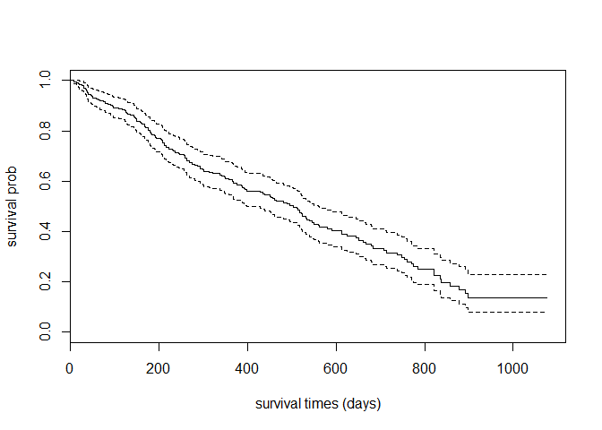<!-- -->

We will plot the survival probability against time for observations based on clinic.


```r
str(data1$clinic)
```

```
##  Factor w/ 2 levels "clinic1","clinic2": 1 1 1 1 1 1 1 1 1 1 ...
```

```r
str(data1$prison)
```

```
##  Factor w/ 2 levels "no record","has_previous_rec": 1 2 1 1 2 1 2 2 1 2 ...
```

Let us plot. Note that the *solid* line and *black* color belong to clinic1 and the *dashed* line with *red* color belong to clinic2 


```r
plot(surv.clin, lty=c('solid','dashed'), col=c('black','red'))
```

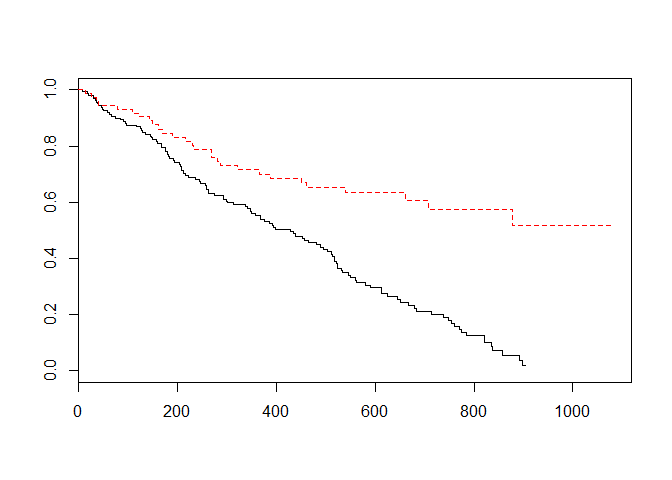<!-- -->

Now, we add legend


```r
plot(surv.clin, lty=c('solid','dashed'), col=c('black','red'))
legend('topright',c('clinic 1','clinic 2'),lty=c('solid','dashed'), col=c('black','red'))
```

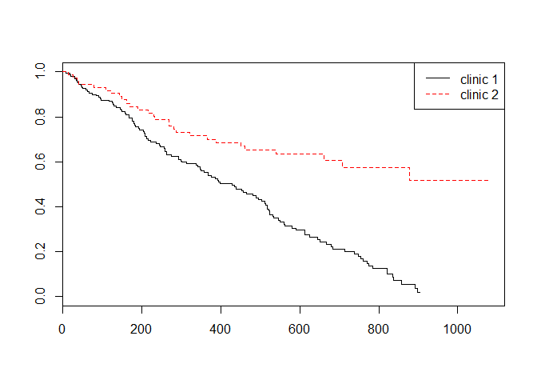<!-- -->

## Inferences based on Kaplan-Meier survival estimates

### The log rank test

To test for the difference in the estimated survival times by the Kaplan-Meier, the default is the log-rank test


```r
survdiff(datas~clinic, data = data1)
```

```
## Call:
## survdiff(formula = datas ~ clinic, data = data1)
## 
##                  N Observed Expected (O-E)^2/E (O-E)^2/V
## clinic=clinic1 163      122     90.9      10.6      27.9
## clinic=clinic2  75       28     59.1      16.4      27.9
## 
##  Chisq= 27.9  on 1 degrees of freedom, p= 1.28e-07
```

# Estimation using the Semi-parametric method

The most common semi-parametric method to estimate the survival probability is the Cox proportional hazard regression model

## The Cox PH model

Efron is default method in R to estimate the survival based on the Cox PH model


```r
data1.cox <- coxph(datas ~ prison + dose + clinic, data = data1)
summary(data1.cox)
```

```
## Call:
## coxph(formula = datas ~ prison + dose + clinic, data = data1)
## 
##   n= 238, number of events= 150 
## 
##                             coef exp(coef)  se(coef)      z Pr(>|z|)    
## prisonhas_previous_rec  0.326555  1.386184  0.167225  1.953   0.0508 .  
## dose                   -0.035369  0.965249  0.006379 -5.545 2.94e-08 ***
## clinicclinic2          -1.009896  0.364257  0.214889 -4.700 2.61e-06 ***
## ---
## Signif. codes:  0 '***' 0.001 '**' 0.01 '*' 0.05 '.' 0.1 ' ' 1
## 
##                        exp(coef) exp(-coef) lower .95 upper .95
## prisonhas_previous_rec    1.3862     0.7214    0.9988    1.9238
## dose                      0.9652     1.0360    0.9533    0.9774
## clinicclinic2             0.3643     2.7453    0.2391    0.5550
## 
## Concordance= 0.665  (se = 0.026 )
## Rsquare= 0.238   (max possible= 0.997 )
## Likelihood ratio test= 64.56  on 3 df,   p=6.228e-14
## Wald test            = 54.12  on 3 df,   p=1.056e-11
## Score (logrank) test = 56.32  on 3 df,   p=3.598e-12
```

column **z** is the ratio between each regression coefficient to its SE. It is a Wald statistic which is asymptotically standard normal under the hypothesis that the corresponding beta is 0.

Other alternatives = Breslow , Exact

Exponentiated coefficients in the second column of the first panel (and in the first column
of the second panel) of the output are interpretable as multiplicative effects on the hazard or simply as **Hazard Ratio**

## Estimated distribution of survival times based on Cox PH model

The survfit function estimates S(t), by default at the **mean values of the covariates**.


```r
survfit(data1.cox)
```

```
## Call: survfit(formula = data1.cox)
## 
##       n  events  median 0.95LCL 0.95UCL 
##     238     150     518     452     591
```

```r
summary(survfit(data1.cox))
```

```
## Call: survfit(formula = data1.cox)
## 
##  time n.risk n.event survival std.err lower 95% CI upper 95% CI
##     7    236       1   0.9967 0.00334       0.9901        1.000
##    13    235       1   0.9933 0.00475       0.9840        1.000
##    17    234       1   0.9899 0.00582       0.9786        1.000
##    19    233       1   0.9865 0.00673       0.9734        1.000
##    26    232       1   0.9831 0.00755       0.9684        0.998
##    29    229       1   0.9797 0.00830       0.9635        0.996
##    30    228       1   0.9762 0.00899       0.9587        0.994
##    33    227       1   0.9727 0.00964       0.9540        0.992
##    35    226       2   0.9658 0.01081       0.9448        0.987
##    37    224       1   0.9623 0.01135       0.9403        0.985
##    41    223       2   0.9553 0.01237       0.9314        0.980
##    47    221       1   0.9518 0.01284       0.9270        0.977
##    49    220       1   0.9483 0.01331       0.9226        0.975
##    50    219       1   0.9448 0.01375       0.9182        0.972
##    59    216       1   0.9413 0.01419       0.9139        0.970
##    62    215       1   0.9377 0.01462       0.9095        0.967
##    67    213       1   0.9341 0.01505       0.9051        0.964
##    75    211       1   0.9305 0.01548       0.9006        0.961
##    79    210       1   0.9268 0.01589       0.8962        0.958
##    84    209       1   0.9231 0.01629       0.8918        0.956
##    90    207       1   0.9194 0.01669       0.8873        0.953
##    95    206       1   0.9157 0.01708       0.8829        0.950
##    96    205       1   0.9120 0.01747       0.8784        0.947
##   109    202       1   0.9082 0.01785       0.8739        0.944
##   117    200       1   0.9044 0.01823       0.8694        0.941
##   122    199       1   0.9006 0.01861       0.8648        0.938
##   126    198       1   0.8968 0.01898       0.8603        0.935
##   127    197       1   0.8929 0.01933       0.8558        0.932
##   129    196       1   0.8890 0.01969       0.8513        0.928
##   136    194       1   0.8851 0.02006       0.8466        0.925
##   143    193       1   0.8811 0.02041       0.8420        0.922
##   145    192       1   0.8771 0.02076       0.8373        0.919
##   147    190       1   0.8731 0.02110       0.8327        0.915
##   149    188       1   0.8691 0.02145       0.8280        0.912
##   150    187       1   0.8650 0.02178       0.8234        0.909
##   157    185       1   0.8610 0.02211       0.8187        0.905
##   160    184       1   0.8569 0.02243       0.8141        0.902
##   161    183       1   0.8528 0.02276       0.8094        0.899
##   167    181       1   0.8487 0.02308       0.8047        0.895
##   168    180       1   0.8446 0.02339       0.8000        0.892
##   170    179       1   0.8405 0.02370       0.7953        0.888
##   175    178       1   0.8363 0.02400       0.7906        0.885
##   176    176       1   0.8322 0.02430       0.7859        0.881
##   180    175       2   0.8238 0.02490       0.7764        0.874
##   181    173       1   0.8196 0.02519       0.7717        0.870
##   183    172       1   0.8154 0.02547       0.7669        0.867
##   190    171       1   0.8111 0.02576       0.7621        0.863
##   192    170       1   0.8068 0.02604       0.7574        0.860
##   193    169       1   0.8026 0.02631       0.7526        0.856
##   204    168       1   0.7983 0.02658       0.7479        0.852
##   205    166       1   0.7940 0.02685       0.7431        0.848
##   207    165       1   0.7896 0.02712       0.7382        0.845
##   209    164       1   0.7853 0.02738       0.7334        0.841
##   212    162       2   0.7764 0.02791       0.7235        0.833
##   216    160       2   0.7674 0.02843       0.7136        0.825
##   223    157       1   0.7629 0.02868       0.7087        0.821
##   231    156       1   0.7583 0.02893       0.7036        0.817
##   232    155       1   0.7537 0.02918       0.6986        0.813
##   237    154       1   0.7492 0.02942       0.6937        0.809
##   244    153       1   0.7446 0.02966       0.6887        0.805
##   247    152       1   0.7400 0.02989       0.6837        0.801
##   257    151       1   0.7354 0.03012       0.6787        0.797
##   258    150       1   0.7308 0.03035       0.6737        0.793
##   259    149       1   0.7261 0.03057       0.6686        0.789
##   262    148       2   0.7167 0.03101       0.6584        0.780
##   268    146       2   0.7073 0.03143       0.6483        0.772
##   275    144       1   0.7026 0.03163       0.6432        0.767
##   280    143       1   0.6978 0.03183       0.6382        0.763
##   286    141       1   0.6931 0.03203       0.6331        0.759
##   293    140       1   0.6884 0.03222       0.6280        0.755
##   294    139       1   0.6836 0.03241       0.6230        0.750
##   299    138       1   0.6789 0.03259       0.6179        0.746
##   302    137       1   0.6742 0.03277       0.6129        0.742
##   314    136       1   0.6694 0.03295       0.6078        0.737
##   322    134       1   0.6645 0.03313       0.6027        0.733
##   337    131       1   0.6596 0.03331       0.5974        0.728
##   341    129       1   0.6546 0.03349       0.5921        0.724
##   348    126       1   0.6494 0.03369       0.5866        0.719
##   350    125       1   0.6442 0.03388       0.5811        0.714
##   358    124       1   0.6390 0.03406       0.5756        0.709
##   366    122       1   0.6338 0.03424       0.5701        0.705
##   367    121       1   0.6285 0.03442       0.5645        0.700
##   368    119       1   0.6232 0.03460       0.5590        0.695
##   376    118       1   0.6179 0.03477       0.5533        0.690
##   386    117       1   0.6125 0.03494       0.5477        0.685
##   389    116       1   0.6071 0.03511       0.5420        0.680
##   393    115       1   0.6017 0.03526       0.5364        0.675
##   394    114       1   0.5963 0.03542       0.5308        0.670
##   399    112       1   0.5909 0.03557       0.5251        0.665
##   428    109       1   0.5852 0.03573       0.5192        0.660
##   434    108       1   0.5796 0.03589       0.5134        0.654
##   438    107       1   0.5739 0.03604       0.5075        0.649
##   450    105       1   0.5682 0.03619       0.5015        0.644
##   452    104       1   0.5625 0.03633       0.4956        0.638
##   457    102       1   0.5568 0.03646       0.4897        0.633
##   460    101       1   0.5509 0.03660       0.4836        0.628
##   465     99       1   0.5450 0.03674       0.4775        0.622
##   482     96       1   0.5389 0.03688       0.4712        0.616
##   489     95       1   0.5326 0.03703       0.4648        0.610
##   496     94       1   0.5264 0.03716       0.4583        0.604
##   504     92       1   0.5201 0.03729       0.4519        0.599
##   512     91       1   0.5137 0.03742       0.4454        0.593
##   514     90       1   0.5074 0.03753       0.4389        0.587
##   517     89       1   0.5011 0.03763       0.4325        0.581
##   518     87       1   0.4946 0.03774       0.4259        0.574
##   522     86       1   0.4881 0.03784       0.4193        0.568
##   523     85       2   0.4752 0.03800       0.4062        0.556
##   532     80       1   0.4684 0.03810       0.3994        0.549
##   533     78       1   0.4617 0.03820       0.3926        0.543
##   540     77       1   0.4549 0.03828       0.3857        0.536
##   546     74       1   0.4478 0.03837       0.3786        0.530
##   550     73       1   0.4407 0.03845       0.3714        0.523
##   560     70       1   0.4334 0.03854       0.3640        0.516
##   563     69       1   0.4260 0.03861       0.3567        0.509
##   581     62       1   0.4179 0.03875       0.3485        0.501
##   591     59       1   0.4096 0.03888       0.3401        0.493
##   612     54       2   0.3919 0.03922       0.3221        0.477
##   624     51       1   0.3828 0.03939       0.3129        0.468
##   646     48       1   0.3735 0.03954       0.3035        0.460
##   652     47       1   0.3641 0.03967       0.2941        0.451
##   661     46       1   0.3548 0.03976       0.2848        0.442
##   667     45       1   0.3455 0.03982       0.2756        0.433
##   679     44       1   0.3360 0.03986       0.2663        0.424
##   683     43       1   0.3260 0.03991       0.2565        0.414
##   708     39       1   0.3155 0.03997       0.2461        0.404
##   714     37       1   0.3049 0.04001       0.2358        0.394
##   739     35       1   0.2941 0.04004       0.2252        0.384
##   749     34       1   0.2832 0.04001       0.2147        0.374
##   755     33       1   0.2724 0.03992       0.2043        0.363
##   760     32       1   0.2613 0.03979       0.1939        0.352
##   771     28       1   0.2487 0.03985       0.1816        0.340
##   774     27       1   0.2360 0.03981       0.1696        0.328
##   785     26       1   0.2231 0.03969       0.1574        0.316
##   821     20       2   0.1922 0.03980       0.1281        0.288
##   836     17       1   0.1764 0.03954       0.1137        0.274
##   837     16       1   0.1596 0.03917       0.0987        0.258
##   857     14       1   0.1413 0.03869       0.0826        0.242
##   878     13       1   0.1225 0.03778       0.0669        0.224
##   892     10       1   0.1016 0.03671       0.0500        0.206
##   899      9       1   0.0771 0.03516       0.0315        0.188
```

The plot method for objects returned by survfit graphs the estimated surivival function, along
with a point-wise 95-percent confidence band.


```r
plot(survfit(data1.cox),
     xlab = 'times', ylab = 'proportion status == 1')
```

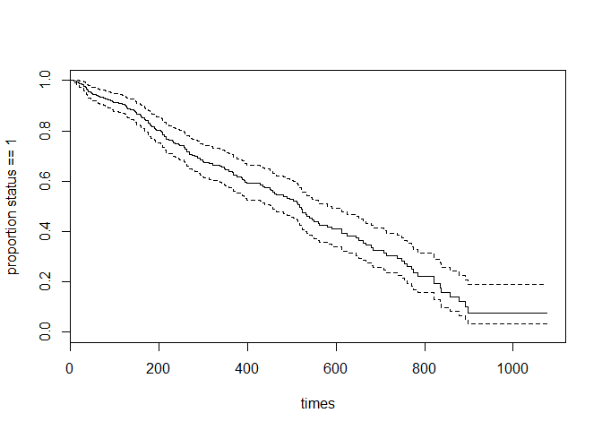<!-- -->


## Checking the PH assumption

Tests and graphical diagnostics for proportional hazards may be based on the scaled Schoenfeld
residuals; these can be obtained directly as *residuals(model, "scaledsch")*, where model is a
*coxph* model object. The matrix returned by residuals has one column for each covariate in
the model. More conveniently, the cox.zph function calculates tests of the proportional-hazards
assumption for each covariate, by correlating the corresponding set of scaled Schoenfeld residuals

### Using graphical methods

We will use *cox.zph*

It computes a test for each covariate, along with a global test for the model as a whole


```r
cox.zph(data1.cox)
```

```
##                            rho chisq        p
## prisonhas_previous_rec -0.0382  0.22 0.639369
## dose                    0.0724  0.70 0.402749
## clinicclinic2          -0.2578 11.19 0.000824
## GLOBAL                      NA 12.62 0.005546
```

Strong evidence of non-proportional hazards for the whole model and for covariate *age*

Get the detailed plots after *cox.zph*. Plotting the object returned by cox.zph produces graphs of the scaled Schoenfeld residuals against transformed time.  Systematic departures from a horizontal line are indicative of
non-proportional hazards.


```r
plot(cox.zph(data1.cox))
```

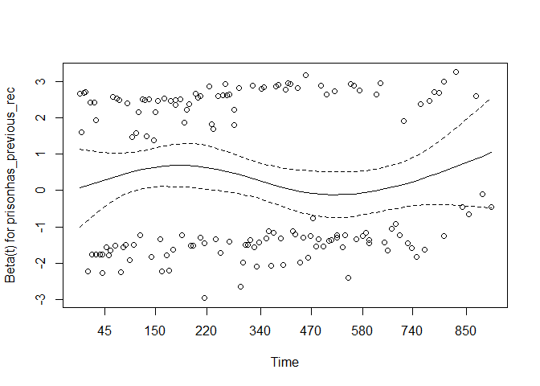<!-- -->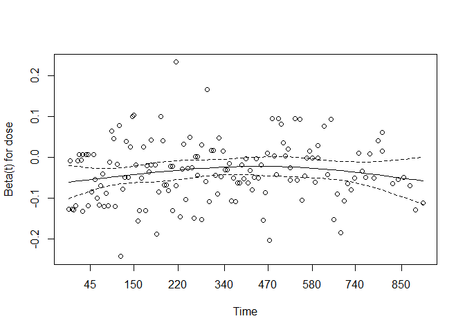<!-- -->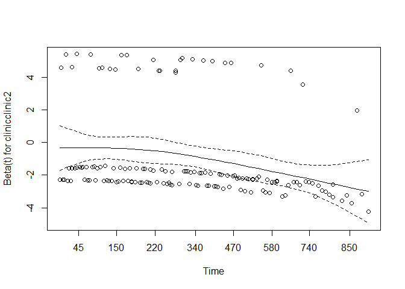<!-- -->


## Modification if a model violates PH assumption 

An alternative to incorporating an interaction in the model is to divide the data into strata based
on the value of one or more covariates. Each stratum is permitted to have a different baseline hazard
function, while the coefficients of the remaining covariates are assumed to be constant across strata.
An advantage of this approach is that we do not have to assume a particular form of interaction
between the stratifying covariates and time. A disadvantage is the resulting inability to examine
the effects of the stratifying covariates. Stratification is most natural when a covariate takes on
only a few distinct values, and when the effect of the stratifying variable is not of direct interest

Run, the strata argument for clinic (which has threaten the proportionality)


```r
str.cox <- coxph(datas ~ prison + dose + strata(clinic),
                 data = data1)
summary(str.cox)
```

```
## Call:
## coxph(formula = datas ~ prison + dose + strata(clinic), data = data1)
## 
##   n= 238, number of events= 150 
## 
##                             coef exp(coef)  se(coef)      z Pr(>|z|)    
## prisonhas_previous_rec  0.389605  1.476397  0.168930  2.306   0.0211 *  
## dose                   -0.035115  0.965495  0.006465 -5.432 5.59e-08 ***
## ---
## Signif. codes:  0 '***' 0.001 '**' 0.01 '*' 0.05 '.' 0.1 ' ' 1
## 
##                        exp(coef) exp(-coef) lower .95 upper .95
## prisonhas_previous_rec    1.4764     0.6773    1.0603    2.0559
## dose                      0.9655     1.0357    0.9533    0.9778
## 
## Concordance= 0.651  (se = 0.034 )
## Rsquare= 0.133   (max possible= 0.994 )
## Likelihood ratio test= 33.91  on 2 df,   p=4.322e-08
## Wald test            = 32.66  on 2 df,   p=8.076e-08
## Score (logrank) test = 33.33  on 2 df,   p=5.774e-08
```

Any existing violation of PH assumption


```r
cox.zph(str.cox)
```

```
##                            rho  chisq     p
## prisonhas_previous_rec -0.0205 0.0628 0.802
## dose                    0.0860 0.9953 0.318
## GLOBAL                      NA 1.0186 0.601
```

Nope. All are good. All fulfill PH assumption. 

## Cox PH model with interaction term

Read page 197 and 198 Applied Survival Analysis by Hosmer and Lemeshow. 

# Prediction

## Predict relative risk 

We use `predict.coxph` to predict the outcomes after running the Cox PH model. For example to obtain the relative risk; that is the risk of population of interest (with a set of covariates) against the population average, we can use these:


```r
pred_risk <- predict(data1.cox, type = 'risk')
cbind(head(data1[, c('prison', 'dose', 'clinic')]), 
      head(pred_risk))
```

```
##             prison dose  clinic head(pred_risk)
## 1        no record   50 clinic1        1.705322
## 2 has_previous_rec   55 clinic1        1.980725
## 3        no record   55 clinic1        1.428904
## 4        no record   30 clinic1        3.459550
## 5 has_previous_rec   65 clinic1        1.390649
## 6        no record   55 clinic1        1.428904
```

## Plot the expected survival probability after Cox model

We can plot the survival probability against time based on the Cox PH model 


```r
plot(survfit(data1.cox), col=4, 
     xlab = 'time', ylab = 'survival prob', main = 'survival prob against time based on Cox model')
```

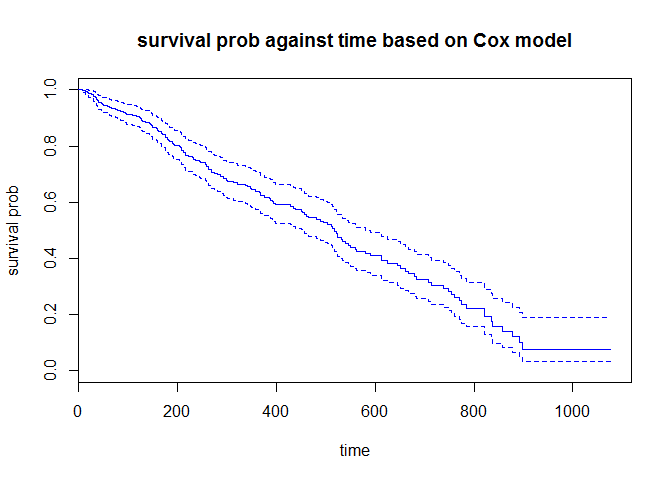<!-- -->


# Model assessment

## Influential observation

Check the dfbeta values


```r
dfbeta <- residuals(data1.cox, type="dfbeta")
par(mfrow=c(2, 2))
for (j in 1:3) {plot(dfbeta[, j], ylab=names(coef(data1.cox))[j])
abline(h=0, lty=2)
}
```

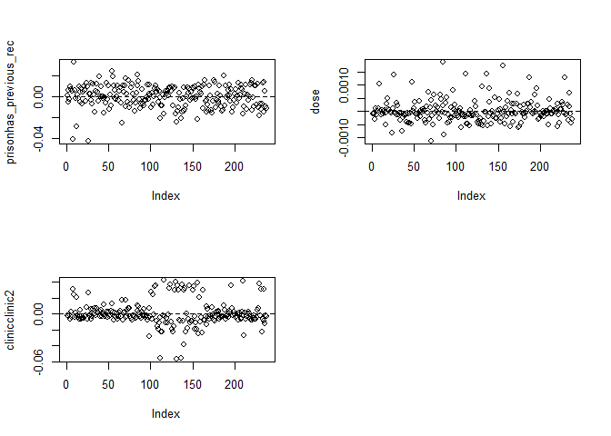<!-- -->

Summarize the dfbetas values


```r
names(coef(data1.cox))
```

```
## [1] "prisonhas_previous_rec" "dose"                  
## [3] "clinicclinic2"
```

```r
summary(dfbeta)
```

```
##        V1                   V2                   V3           
##  Min.   :-0.0420194   Min.   :-1.124e-03   Min.   :-0.056857  
##  1st Qu.:-0.0069652   1st Qu.:-2.093e-04   1st Qu.:-0.006397  
##  Median : 0.0004387   Median :-7.285e-05   Median :-0.002787  
##  Mean   : 0.0000000   Mean   : 0.000e+00   Mean   : 0.000000  
##  3rd Qu.: 0.0081117   3rd Qu.: 1.282e-04   3rd Qu.: 0.003349  
##  Max.   : 0.0322183   Max.   : 1.851e-03   Max.   : 0.042105
```

Plot the dfbetas values


```r
plot(dfbeta[,1]) #prison
```

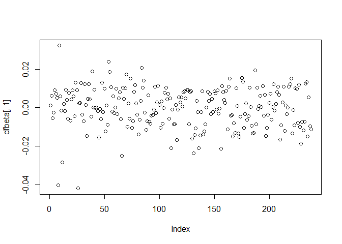<!-- -->

```r
plot(dfbeta[,2]) #dose
```

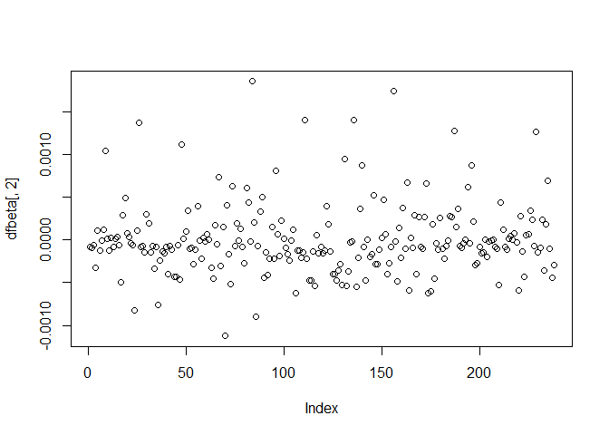<!-- -->

```r
plot(dfbeta[,3]) #clinic
```

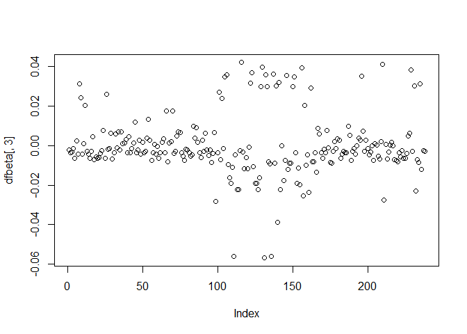<!-- -->

# Additional tutorial

method 1


```r
plot(surv.clin,fun='cloglog',
    xlab='time(days) using log scale', ylab='log-log survival prob',
    main='log-log curves by clinics')
```

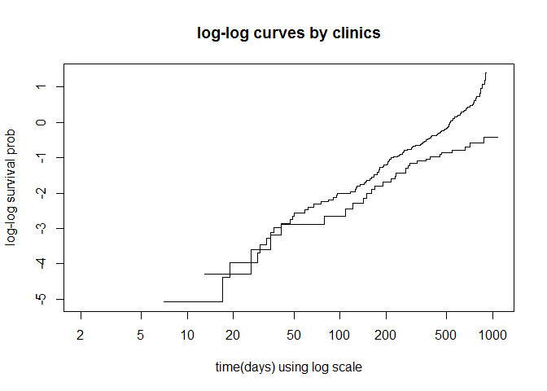<!-- -->


Looks the curves cross each other. This indicate model violate PH assumption

## Using statistical test


```r
test.ph <- coxph(datas ~ prison + dose + clinic, data = data1)
test.ph2 <- cox.zph(test.ph, transform = rank)
test.ph2
```

```
##                            rho  chisq       p
## prisonhas_previous_rec -0.0462  0.322 0.57068
## dose                    0.0905  1.096 0.29521
## clinicclinic2          -0.2498 10.495 0.00120
## GLOBAL                      NA 12.425 0.00606
```

```r
# var = clinic means residuals should pertain to the variable clinic
plot(test.ph2, se=FALSE, vsr = "clinic")
```

```
## Warning in plot.window(...): "vsr" is not a graphical parameter
```

```
## Warning in plot.xy(xy, type, ...): "vsr" is not a graphical parameter
```

```
## Warning in title(...): "vsr" is not a graphical parameter
```

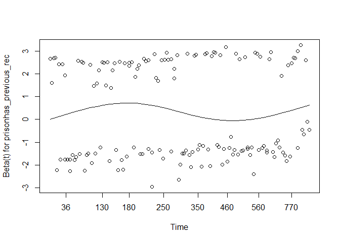<!-- -->

```
## Warning in plot.window(...): "vsr" is not a graphical parameter
```

```
## Warning in plot.xy(xy, type, ...): "vsr" is not a graphical parameter
```

```
## Warning in title(...): "vsr" is not a graphical parameter
```

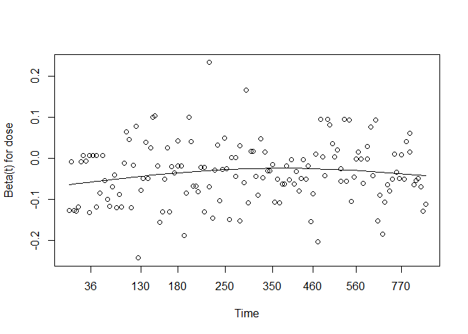<!-- -->

```
## Warning in plot.window(...): "vsr" is not a graphical parameter
```

```
## Warning in plot.xy(xy, type, ...): "vsr" is not a graphical parameter
```

```
## Warning in title(...): "vsr" is not a graphical parameter
```

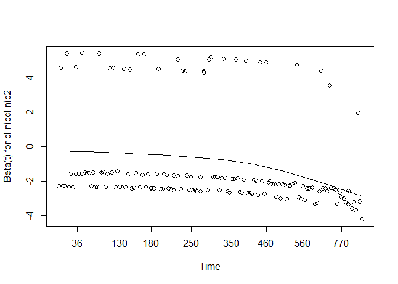<!-- -->

# Running stratified Cox model

When models violate PH assumption. in our case, 'clinic' does violate PH assumption but others are not. So we do stratified Cox model


```r
surv.strata <- coxph(datas ~ prison + dose + strata(clinic), data = data1)
summary(surv.strata)
```

```
## Call:
## coxph(formula = datas ~ prison + dose + strata(clinic), data = data1)
## 
##   n= 238, number of events= 150 
## 
##                             coef exp(coef)  se(coef)      z Pr(>|z|)    
## prisonhas_previous_rec  0.389605  1.476397  0.168930  2.306   0.0211 *  
## dose                   -0.035115  0.965495  0.006465 -5.432 5.59e-08 ***
## ---
## Signif. codes:  0 '***' 0.001 '**' 0.01 '*' 0.05 '.' 0.1 ' ' 1
## 
##                        exp(coef) exp(-coef) lower .95 upper .95
## prisonhas_previous_rec    1.4764     0.6773    1.0603    2.0559
## dose                      0.9655     1.0357    0.9533    0.9778
## 
## Concordance= 0.651  (se = 0.034 )
## Rsquare= 0.133   (max possible= 0.994 )
## Likelihood ratio test= 33.91  on 2 df,   p=4.322e-08
## Wald test            = 32.66  on 2 df,   p=8.076e-08
## Score (logrank) test = 33.33  on 2 df,   p=5.774e-08
```

# Running stratified Cox model with interaction


```r
surv.strata.ia <- coxph(datas ~ prison + dose + clinic:dose + clinic:prison + strata(clinic), data=data1)
summary(surv.strata.ia)
```

```
## Call:
## coxph(formula = datas ~ prison + dose + clinic:dose + clinic:prison + 
##     strata(clinic), data = data1)
## 
##   n= 238, number of events= 150 
## 
##                                           coef exp(coef)  se(coef)      z
## prisonhas_previous_rec                0.502846  1.653421  0.188706  2.665
## dose                                 -0.035799  0.964834  0.007738 -4.626
## dose:clinicclinic2                   -0.001164  0.998837  0.014570 -0.080
## prisonhas_previous_rec:clinicclinic2 -0.582989  0.558227  0.428135 -1.362
##                                      Pr(>|z|)    
## prisonhas_previous_rec                0.00771 ** 
## dose                                 3.72e-06 ***
## dose:clinicclinic2                    0.93632    
## prisonhas_previous_rec:clinicclinic2  0.17329    
## ---
## Signif. codes:  0 '***' 0.001 '**' 0.01 '*' 0.05 '.' 0.1 ' ' 1
## 
##                                      exp(coef) exp(-coef) lower .95
## prisonhas_previous_rec                  1.6534     0.6048    1.1422
## dose                                    0.9648     1.0364    0.9503
## dose:clinicclinic2                      0.9988     1.0012    0.9707
## prisonhas_previous_rec:clinicclinic2    0.5582     1.7914    0.2412
##                                      upper .95
## prisonhas_previous_rec                  2.3934
## dose                                    0.9796
## dose:clinicclinic2                      1.0278
## prisonhas_previous_rec:clinicclinic2    1.2919
## 
## Concordance= 0.649  (se = 0.034 )
## Rsquare= 0.14   (max possible= 0.994 )
## Likelihood ratio test= 35.77  on 4 df,   p=3.222e-07
## Wald test            = 34.09  on 4 df,   p=7.138e-07
## Score (logrank) test = 34.97  on 4 df,   p=4.706e-07
```

Calculating the HR

If we want to calculate the HR betwwen PRISON=1 vs PRISON=0 for CLINIC=2, then one way is by making CLINIC equals 0. So when CLINIC==2, then CLINIC2==0. 


```r
data1$clinic2<- (as.numeric(data1$clinic)) - 1
summary(data1$clinic2)
```

```
##    Min. 1st Qu.  Median    Mean 3rd Qu.    Max. 
##  0.0000  0.0000  0.0000  0.3151  1.0000  1.0000
```

```r
head(as.numeric(data1$clinic))
```

```
## [1] 1 1 1 1 1 1
```

```r
surv.strata.ia2 <- coxph(datas ~ prison + dose +  clinic2:dose + clinic2:(as.numeric(prison)) +
                       strata(clinic2),data=data1)
summary(surv.strata.ia2)
```

```
## Call:
## coxph(formula = datas ~ prison + dose + clinic2:dose + clinic2:(as.numeric(prison)) + 
##     strata(clinic2), data = data1)
## 
##   n= 238, number of events= 150 
## 
##                                 coef exp(coef)  se(coef)      z Pr(>|z|)
## prisonhas_previous_rec      0.502846  1.653421  0.188706  2.665  0.00771
## dose                       -0.035799  0.964834  0.007738 -4.626 3.72e-06
## dose:clinic2               -0.001164  0.998837  0.014570 -0.080  0.93632
## clinic2:as.numeric(prison) -0.582989  0.558227  0.428135 -1.362  0.17329
##                               
## prisonhas_previous_rec     ** 
## dose                       ***
## dose:clinic2                  
## clinic2:as.numeric(prison)    
## ---
## Signif. codes:  0 '***' 0.001 '**' 0.01 '*' 0.05 '.' 0.1 ' ' 1
## 
##                            exp(coef) exp(-coef) lower .95 upper .95
## prisonhas_previous_rec        1.6534     0.6048    1.1422    2.3934
## dose                          0.9648     1.0364    0.9503    0.9796
## dose:clinic2                  0.9988     1.0012    0.9707    1.0278
## clinic2:as.numeric(prison)    0.5582     1.7914    0.2412    1.2919
## 
## Concordance= 0.649  (se = 0.034 )
## Rsquare= 0.14   (max possible= 0.994 )
## Likelihood ratio test= 35.77  on 4 df,   p=3.222e-07
## Wald test            = 34.09  on 4 df,   p=7.138e-07
## Score (logrank) test = 34.97  on 4 df,   p=4.706e-07
```

# References:

1.  <https://socserv.socsci.mcmaster.ca/jfox/Books/Companion/appendix/Appendix-Cox-Regression.pdf>
2. Reference for calculating the relative risk <http://stats.stackexchange.com/questions/44896/how-to-interpret-the-output-of-predict-coxph>
3.  Another reference for predicting the outcomes after Cox model <http://datamining.togaware.com/survivor/Lung1.html>
